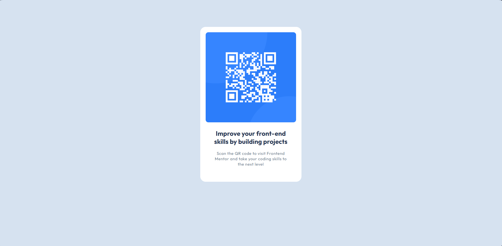

## Welcome! 👋

## Table of contents

- [Overview](#overview)
  - [Screenshot](#screenshot)
  - [Links](#links)
- [Built with](#built-with)
- [Author](#author)

**Note: Delete this note and update the table of contents based on what sections you keep.**

## Overview

This is a small project where I am practicing to enhance my skills. It involves creating a QR code card that contains specific information

### Screenshot

### Links

- Solution URL: [Add solution URL here](https://your-solution-url.com)

### Built with

- Semantic HTML5 markup
- CSS custom properties
- Flexbox
- Mobile-first workflow

**Note: These are just examples. Delete this note and replace the list above with your own choices**

## Author

- Linkedin - [Nicolás Forneiro](https://www.linkedin.com/feed/)
- Frontend Mentor - [@forneiro](https://www.frontendmentor.io/profile/forneiro)
- Github - [@forneiro](https://github.com/forneiro)
